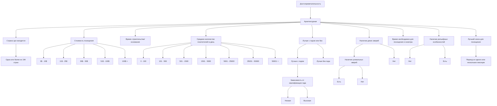

```mermaid
flowchart TD
Достопримечательность ---> Архитектурная

Архитектурная ---> Country_of_residence_architectural[Страна где находится]
Архитектурная ---> Cost_of_visit_architectural[Стоимость посещения]
Архитектурная ---> Founding_date_architectural[Время строительства/основания]
Архитектурная ---> Count_of_visitors_architectural[Среднее количество посетителей в день]
Архитектурная ---> Guide_architectural[Лучше с гидом или без]
Архитектурная ---> Wild_animals_architectural[Наличие диких зверей]
Архитектурная ---> Needed_time_architectural[Время необходимое для посещения и осмотра]
Архитектурная ---> Relief_features_architectural[Наличие рельефных особенностей]
Архитектурная ---> Best_season_for_visit_architectural[Лучший сезон для посещения]

Country_of_residence_architectural ---> Countries_architectural[Одна или более из 194 стран]

Cost_of_visit_architectural ---> low_cost_architectural[0$ - 10$]
Cost_of_visit_architectural ---> upper_low_cost_architectural[11$ - 25$]
Cost_of_visit_architectural ---> medium_cost_architectural[26$ - 50$]
Cost_of_visit_architectural ---> upper_medium_cost_architectural[51$ - 100$]
Cost_of_visit_architectural ---> high_cost_architectural[100$ +]

Count_of_visitors_architectural ---> super_low_count_architectural[0 - 100]
Count_of_visitors_architectural ---> low_count_architectural[101 - 500]
Count_of_visitors_architectural ---> upper_low_count_architectural[501 - 1500]
Count_of_visitors_architectural ---> medium_count_architectural[1501 - 5000]
Count_of_visitors_architectural ---> upper_medium_count_architectural[5001 - 25000]
Count_of_visitors_architectural ---> high_count_architectural[25001 - 50000]
Count_of_visitors_architectural ---> mega_high_count_architectural[50001 +]

Guide_architectural ---> Better_with_guide_architectural[Лучше с гидом]
Guide_architectural ---> Better_without_guide_architectural[Лучше без гида]

Better_with_guide_architectural ---> Guide_dependecy_architectural[Зависимость от квалификации гида]

Guide_dependecy_architectural ---> Low_guide_dependecy_architectural[Низкая]
Guide_dependecy_architectural ---> High_guide_dependecy_architectural[Высокая]

Wild_animals_architectural ---> Presence_of_unique_animals_architectural[Наличие уникальных зверей]
Wild_animals_architectural ---> No_wild_animals_architectural[Нет]

Presence_of_unique_animals_architectural ---> Presence_of_unique_animals_yes_architectural[Есть]
Presence_of_unique_animals_architectural ---> Presence_of_unique_animals_no_architectural[Нет]

Relief_features_architectural ---> No_rilief_fetures_architectural[Нет]
Relief_features_architectural ---> Yes_rilief_fetures_architectural[Есть]

Best_season_for_visit_architectural ---> Period_architectural[Период из одного или нескольких месяцев]
```