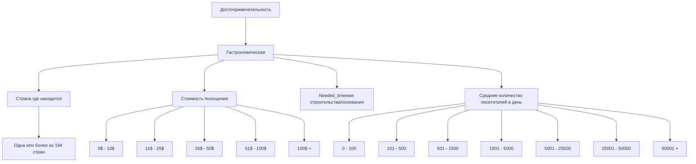

```mermaid
flowchart TD
Достопримечательность ---> Гастрономическая

Гастрономическая ---> Country_of_residence_gastronomic[Страна где находится]
Гастрономическая ---> Cost_of_visit_gastronomic[Стоимость посещения]
Гастрономическая ---> Founding_date_gastronomic[Needed_timeемя строительства/основания]
Гастрономическая ---> Count_of_visitors_gastronomic[Среднее количество посетителей в день]

Country_of_residence_gastronomic ---> Countries_gastronomic[Одна или более из 194 стран]

Cost_of_visit_gastronomic ---> low_cost_gastronomic[0$ - 10$]
Cost_of_visit_gastronomic ---> upper_low_cost_gastronomic[11$ - 25$]
Cost_of_visit_gastronomic ---> medium_cost_gastronomic[26$ - 50$]
Cost_of_visit_gastronomic ---> upper_medium_cost_gastronomic[51$ - 100$]
Cost_of_visit_gastronomic ---> high_cost_gastronomic[100$ +]

Count_of_visitors_gastronomic ---> super_low_count_gastronomic[0 - 100]
Count_of_visitors_gastronomic ---> low_count_gastronomic[101 - 500]
Count_of_visitors_gastronomic ---> upper_low_count_gastronomic[501 - 1500]
Count_of_visitors_gastronomic ---> medium_count_gastronomic[1501 - 5000]
Count_of_visitors_gastronomic ---> upper_medium_count_gastronomic[5001 - 25000]
Count_of_visitors_gastronomic ---> high_count_gastronomic[25001 - 50000]
Count_of_visitors_gastronomic ---> mega_high_count_gastronomic[50001 +]
```