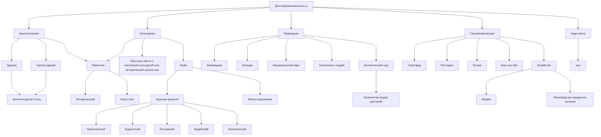

```mermaid
flowchart TD
Достопримечательность ---> Архитектурная
Достопримечательность ---> Культурная
Достопримечательность ---> Природная
Достопримечательность ---> Гастрономическая
Достопримечательность ---> World_miracle[Чудо света]

Архитектурная ---> Здание
Здание ---> Style[Архитектурный стиль]
Архитектурная ---> Group[Группа зданий]
Group ---> Style[Архитектурный стиль]
Архитектурная ---> Памятник

Культурная ---> Памятник
Памятник ---> Исторический
Памятник ---> Искусство
Культурная ---> Place[Обычное место с некоторой культурной или исторической ценностью]
Культурная ---> Храм
Храм ---> Big_religion[Крупная религия]
Храм ---> Small_religion[Малое верование]
Big_religion ---> Христианский
Big_religion ---> Будистский
Big_religion ---> Исламский
Big_religion ---> Иудейский
Big_religion ---> Католический


Природная ---> Заповедник
Природная ---> Зоопарк
Природная ---> National_park[Национальный парк]
Природная ---> Water[Связанная с водой]
Природная ---> Botanic[Ботанический сад]
Botanic ---> Count_flowers[Количество видов растений]

Гастрономическая ---> Стритфуд
Гастрономическая ---> Ресторан
Гастрономическая ---> Рынок
Гастрономическая ---> Bar_or_pub[Бар или паб]
Гастрономическая ---> Хозяйство
Хозяйство ---> Ферма
Хозяйство ---> Production[Производство продуктов питания]

World_miracle ---> хых
```