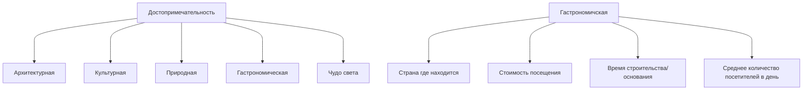

```mermaid
flowchart TD
Достопримечательность ---> Архитектурная
Достопримечательность ---> Культурная
Достопримечательность ---> Природная
Достопримечательность ---> Гастрономическая
Достопримечательность ---> ЧС[Чудо света]

Гастрономичская ---> СН[Страна где находится]
Гастрономичская ---> СП[Стоимость посещения]
Гастрономичская ---> ВО[Время строительства/основания]
Гастрономичская ---> КТ[Среднее количество посетителей в день]
```