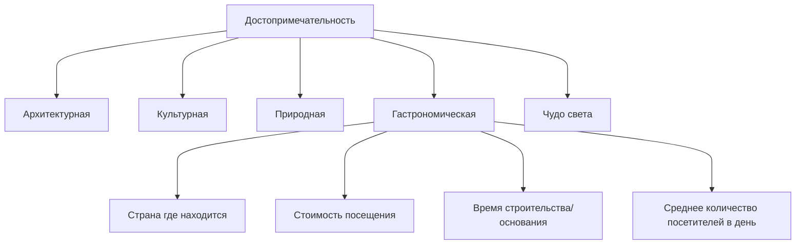

```mermaid
flowchart TD
Достопримечательность ---> Архитектурная
Достопримечательность ---> Культурная
Достопримечательность ---> Природная
Достопримечательность ---> Гастрономическая
Достопримечательность ---> ЧС[Чудо света]

Гастрономическая ---> СН[Страна где находится]
Гастрономическая ---> СП[Стоимость посещения]
Гастрономическая ---> ВО[Время строительства/основания]
Гастрономическая ---> КТ[Среднее количество посетителей в день]
```