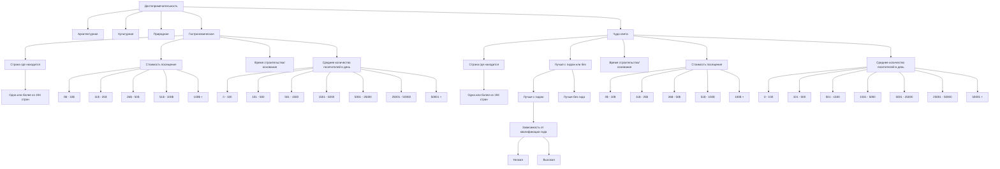

```mermaid
flowchart TD
Достопримечательность ---> Архитектурная
Достопримечательность ---> Культурная
Достопримечательность ---> Природная
Достопримечательность ---> Гастрономическая
Достопримечательность ---> ЧС[Чудо света]

Гастрономическая ---> СН[Страна где находится]
Гастрономическая ---> СП[Стоимость посещения]
Гастрономическая ---> ВО[Время строительства/основания]
Гастрономическая ---> КТ[Среднее количество посетителей в день]

СН ---> Страны[Одна или более из 194 стран]

СП ---> low_cost[0$ - 10$]
СП ---> upper_low_cost[11$ - 25$]
СП ---> medium_cost[26$ - 50$]
СП ---> upper_medium_cost[51$ - 100$]
СП ---> high_cost[100$ +]

КТ ---> super_low_count[0 - 100]
КТ ---> low_count[101 - 500]
КТ ---> upper_low_count[501 - 1500]
КТ ---> medium_count[1501 - 5000]
КТ ---> upper_medium_count[5001 - 25000]
КТ ---> high_count[25001 - 50000]
КТ ---> mega_high_count[50001 +]

ЧС ---> КТчс[Среднее количество посетителей в день]
ЧС ---> СНчс[Страна где находится]
ЧС ---> ВОчс[Время строительства/основания]
ЧС ---> СПчс[Стоимость посещения]
ЧС ---> Гидчс[Лучше с гидом или без]

СНчс ---> Страны_wm[Одна или более из 194 стран]

Гидчс ---> ЛСГчс[Лучше с гидом]
Гидчс ---> ЛБГчс[Лучше без гида]

ЛСГчс ---> Зависимостьчс[Зависимость от квалификации гида]
Зависимостьчс ---> Нчс[Низкая]
Зависимостьчс ---> Вчс[Высокая]

СПчс ---> low_cost_wm[0$ - 10$]
СПчс ---> upper_low_cost_wm[11$ - 25$]
СПчс ---> medium_cost_wm[26$ - 50$]
СПчс ---> upper_medium_cost_wm[51$ - 100$]
СПчс ---> high_cost_wm[100$ +]

КТчс ---> super_low_count_wm[0 - 100]
КТчс ---> low_count_wm[101 - 500]
КТчс ---> upper_low_count_wm[501 - 1500]
КТчс ---> medium_count_wm[1501 - 5000]
КТчс ---> upper_medium_count_wm[5001 - 25000]
КТчс ---> high_count_wm[25001 - 50000]
КТчс ---> mega_high_count_wm[50001 +]


```