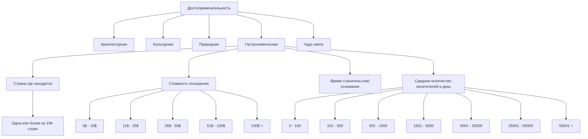

```mermaid
flowchart TD
Достопримечательность ---> Архитектурная
Достопримечательность ---> Культурная
Достопримечательность ---> Природная
Достопримечательность ---> Гастрономическая
Достопримечательность ---> ЧС[Чудо света]

Гастрономическая ---> СН[Страна где находится]
Гастрономическая ---> СП[Стоимость посещения]
Гастрономическая ---> ВО[Время строительства/основания]
Гастрономическая ---> КТ[Среднее количество посетителей в день]

СН ---> Страны[Одна или более из 194 стран]

СП ---> low_cost[0$ - 10$]
СП ---> upper_low_cost[11$ - 25$]
СП ---> medium_cost[26$ - 50$]
СП ---> upper_medium_cost[51$ - 100$]
СП ---> high_cost[100$ +]

КТ ---> super_low_count[0 - 100]
КТ ---> low_count[101 - 500]
КТ ---> upper_low_count[501 - 1500]
КТ ---> medium_count[1501 - 5000]
КТ ---> upper_medium_count[5001 - 25000]
КТ ---> high_count[25001 - 50000]
КТ ---> mega_high_count[50001 +]
```